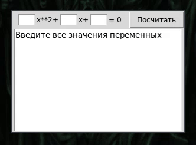

# Square-calculator

-----------------------------------------English note-------------------------------------------------------------

Good square calculator aviable by tkinter(tk/tcl gui set for python)

You need only add numbers to gapps and watching result!

Good using!

---------------------------------------------------------------------------------------------------------------------

Прекрасный калькулятор квадратных уравнений реализован при помощи tkinter(привязка графического стека tk/tcl для python)

Достаточно лишь ввести значения числа в пустые поля,нажать "посчитать" и посмотреть результат

Приятного использования!
